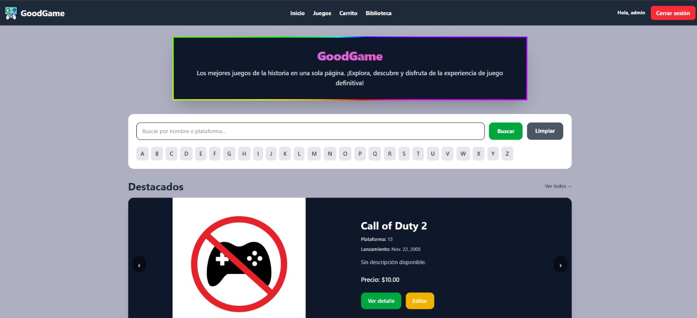
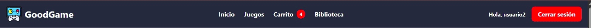
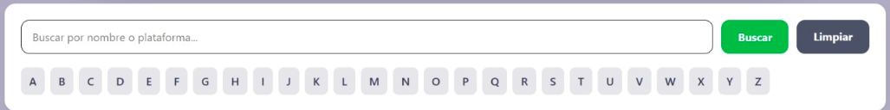
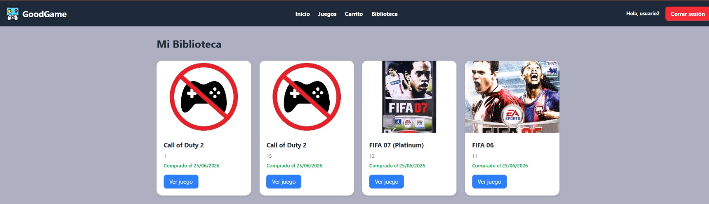

# 🎮 GoodGame - Plataforma Web de Videojuegos

Plataforma web. Este sistema permite a los usuarios explorar un amplio catálogo de videojuegos, gestionar un carrito de compras, armar su biblioteca personal y compartir reseñas con la comunidad.

## ✨ Características Principales

* **Exploración Dinámica:** Página de inicio con carrusel de juegos destacados y un catálogo completo ordenado alfabéticamente.
* **Sistema de Usuarios y Roles:** Autenticación de usuarios con diferenciación de permisos. Los administradores (Staff) tienen acceso exclusivo a las herramientas de gestión (ABM de juegos).
* **Integración de API:** Consumo de la API de TheGamesDB para importar automáticamente información, portadas y detalles de lanzamiento de los videojuegos.
* **Interacción de la Comunidad:** Sistema de reseñas integrado donde los usuarios (y si quieren tambien los miembros del 'Staff') pueden dejar su opinión sobre los títulos jugados, con distintivos visuales para los comentarios de los administradores.
* **Carrito y Biblioteca:** Flujo completo de "compra" donde los usuarios agregan juegos al carrito y, al confirmar, estos pasan a su biblioteca personal permanente.

## 📸 Proyecto en Funcionamiento

### Pantalla de Inicio y Catálogo
Aquí se puede apreciar la página principal, la cual cuenta con un carrusel dinámico exhibiendo los juegos destacados del momento, seguido de la grilla completa del catálogo disponible.

### Navegación Principal
El menú de navegación de la plataforma, que se adapta según el estado de sesión del usuario, brindando acceso rápido al inicio, catálogo, carrito de compras y biblioteca personal.

### Buscador 
Permite al usuario filtrar los juegos por su nombre, brindando un rapido y directo acceso segun las necesidades del mismo.

### Biblioteca del Usuario
Espacio personal donde se almacenan todos los videojuegos que el usuario ha adquirido a través de la simulación del carrito de compras.

## 🛠️ Tecnologías Utilizadas

* **Backend:** Django 6.0.6 (Python 3.12)
* **Frontend:** HTML5, Tailwind CSS v4 (Standalone)
* **Base de Datos:** SQLite3
* **Integraciones:** API REST (TheGamesDB) usando la librería `requests`

## ⚙️ Instalación y Configuración Local

1. **Clonar el repositorio:**
git clone git@github.com:RoyScc/videojuegos-django.git
cd videojuegos-django

2. **Crear y activar el entorno:**
python3 -m venv venv
source venv/bin/activate  # En Linux/Mac
venv\Scripts\activate   # En Windows

3. **Instalar dependencias::**
pip install -r requirements.txt

4. **Variables de entorno:**
Crea un archivo .env en la misma carpeta donde se encuentra settings.py para la conexión con la API:
GAMESDB_API_KEY=clave_api
DEBUG=True

5. **Preparar la Base de Datos:**
python manage.py makemigrations
python manage.py migrate

6. **Dar ejecucion a servidor de tailwind:**
python manage.py tailwind start

7. **Ejecutar servidor local:**
python manage.py runserver

8. **Dentro de la app:**
Importar juegos e imagenes de la API TheGamesDB
